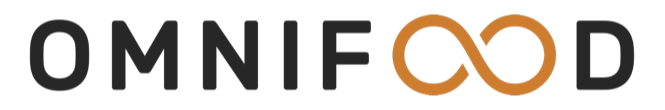

# 🍊 Omnifood

A modern, fully responsive landing page for Omnifood - an AI-powered food subscription service that delivers healthy meals 365 days a year.

Link of the website: https://app.netlify.com/projects/omnifood-sa3a/overview

## ✨ Features

- 🎨 **Modern Design** - Clean and professional UI with smooth animations
- 📱 **Fully Responsive** - Works seamlessly on desktop, tablet, and mobile devices
- 🍔 **Interactive Menu** - Mobile-friendly navigation with smooth scrolling
- 🎯 **Sticky Header** - Navigation follows you as you scroll
- 📝 **Contact Form** - Integrated with Netlify for easy form submissions
- ⚡ **Optimized Performance** - WebP images and efficient code
- ♿ **Accessible** - Built with semantic HTML and ARIA labels

## 🛠️ Technologies Used

- **HTML5** - Semantic markup
- **CSS3** - Modern styling with Flexbox and Grid
- **JavaScript** - Vanilla JS for interactivity
- **Ionicons** - Beautiful icon library
- **Google Fonts** - Rubik font family

## 📱 Responsive Breakpoints

- **Desktop**: 1200px and above
- **Tablet**: 768px - 1199px
- **Mobile**: Below 768px

## 🎯 Key Sections

- **Hero** - Eye-catching introduction with CTA buttons
- **Featured In** - Trusted by major publications
- **How It Works** - 3-step process explanation
- **Meals** - Sample meal cards with dietary information
- **Testimonials** - Customer reviews with photo gallery
- **Pricing** - Two subscription plans
- **CTA** - Sign-up form for free trial
